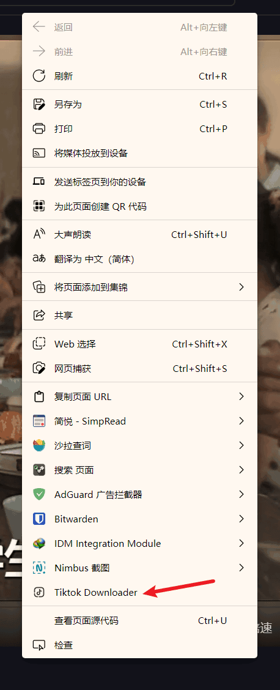

# Tiktok-Downloader
> 一款 抖音/tiktok 无水印下载插件

### 安装

在release页面下载crx文件，如果不能使用，直接下载zip文件解压后，然后直接把整个文件夹拖到浏览器里（注意要打开开发者模式）

可以参考这篇文章：[Chrome插件安装教程 (详细版) - 知乎](https://zhuanlan.zhihu.com/p/107949967)

### 使用方法

1. #### 直接点击插件

   

2. #### 使用右键菜单

​		右键非视频区域，会有一个`Tiktok Downloader`的选项，点击之后会在一个新标签页中打开无水印的视频，自行保存即可。

  

2. #### 直接下载

   由于浏览器安全限制，直接访问服务器会导致CORS错误，因此需要安装插件

   火狐用户：`CORS Everywhere` [下载地址](https://www.aliyundrive.com/s/6XWhdKda7VS)

   Chrome/Edge用户: `CORS Unblock` [CORS Unblock | Chrome扩展 - Crx搜搜 (crxsoso.com)](https://www.crxsoso.com/webstore/detail/lfhmikememgdcahcdlaciloancbhjino)

   打开CORS插件之后就可以直接点击页面上的`无水印下载`按钮下载

   

   

#### 如果本插件对你有用的话，可以关注一下我的抖音

### 用到的api及教程

[Evil0ctal/Douyin_TikTok_Download_API: 🚀「Douyin_TikTok_Download_API」是一个开箱即用的高性能异步抖音|TikTok数据爬取工具，支持API调用，在线批量解析及下载。](https://github.com/Evil0ctal/Douyin_TikTok_Download_API)

[前端最简单的方法解决跨域（浏览器插件） - 掘金](https://juejin.cn/post/7096004823429939231#heading-1)
